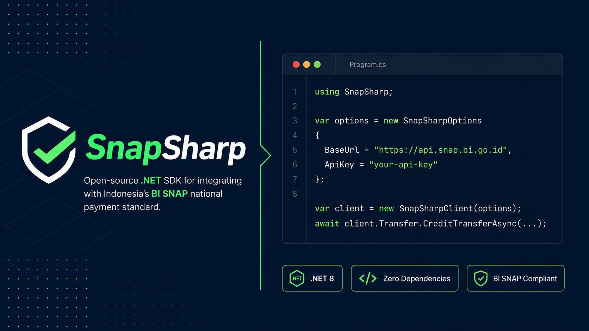
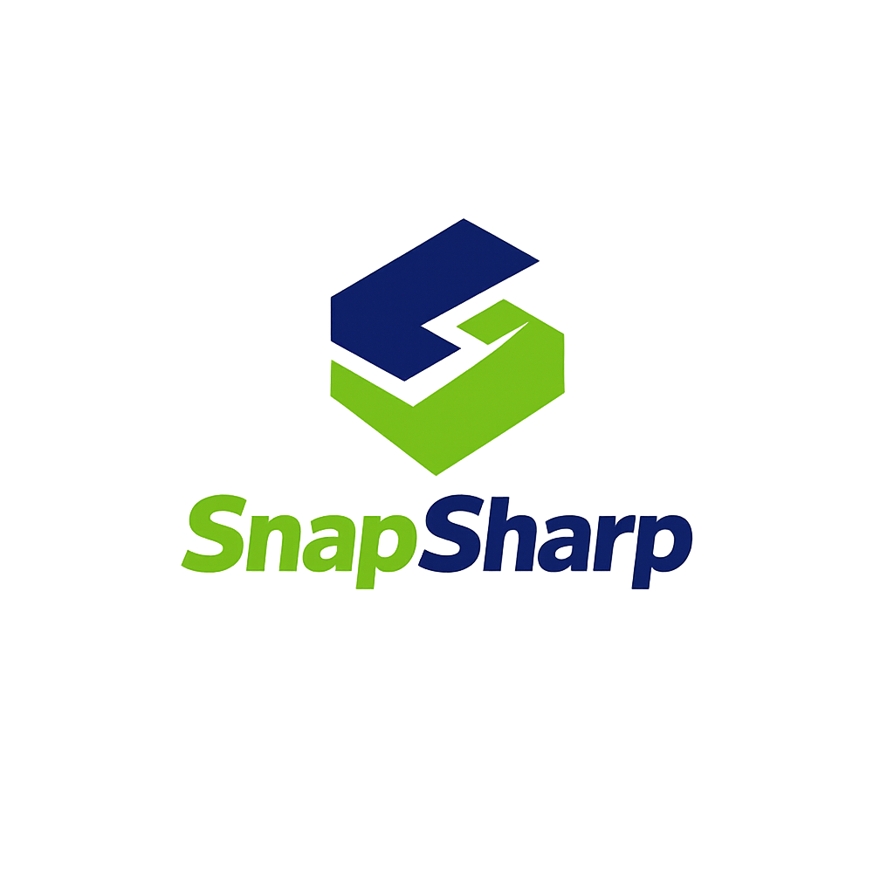

<p align="center">
  
</p>

<p align="center">
  
</p>

# SnapSharp

**.NET SDK for BI SNAP** (Standar Nasional Open API Pembayaran)

[](https://dotnet.microsoft.com)
[](LICENSE)
[](https://www.nuget.org/)

> Open-source, zero-dependency .NET SDK untuk integrasi aplikasi dengan standar BI SNAP yang ditetapkan oleh Bank Indonesia.

## Service Coverage

| Service Category | Endpoint | Status |
|-----------------|----------|--------|
| Keamanan | Access Token B2B | ✅ |
| Keamanan | Access Token B2B2C | ✅ |
| Administrasi | Account Registration Inquiry | ✅ |
| Informasi Saldo | Balance Inquiry | ✅ |
| Riwayat Transaksi | Transaction History | ✅ |
| Transfer Kredit | Credit Transfer (Internal & Interbank) | ✅ |
| Transfer Debit | Direct Debit Registration | ✅ |
| Transfer Debit | Direct Debit Payment | ✅ |
| Virtual Account | Create VA | ✅ |
| Virtual Account | VA Inquiry | ✅ |
| Virtual Account | Payment Notification | ✅ |
| QRIS | QRIS Generate | ✅ |
| QRIS | Payment Notification | ✅ |

## Quick Start

```bash
dotnet add package SnapSharp.Core
```

```csharp
using SnapSharp;

var options = new SnapSharpOptions
{
    BaseUrl = "https://sandbox.bank.co.id",
    ClientId = "your-client-id",
    PrivateKeyPem = File.ReadAllText("private-key.pem"),
    ChannelId = "95221",
    PartnerId = "your-partner-id"
};

using var client = new SnapSharpClient(options);
var token = await client.Auth.GetAccessTokenAsync();
```

## Projects

| Project | Description |
|---------|-------------|
| `SnapSharp.Core` | SDK utama — authentication, service clients, models |
| `SnapSharp.Cli` | CLI tool (`snapsharp`) untuk sandbox testing |
| `SnapSharp.ReferenceApp` | ASP.NET Core Minimal API reference implementation |

## Features

- 🔐 **Auto-signing**: RSA-SHA256 request signing transparan
- 🔄 **Token auto-refresh**: Refresh 30 detik sebelum expiry
- 🧵 **Thread-safe**: Concurrent request aman dengan double-check locking
- ⚡ **Async-first**: Semua API async dengan sync wrapper opsional
- 📦 **Zero dependency**: Hanya `System.Text.Json` (built-in .NET 6+)
- 🛠️ **CLI tool**: Sandbox testing tanpa menulis kode
- 📖 **Swagger UI**: Reference app dengan dokumentasi interaktif

## CLI Usage

```bash
# Install
dotnet tool install -g SnapSharp.Cli

# Generate RSA keys
snapsharp keygen -o ./keys

# Validate config
snapsharp validate -c snapsharp.json

# Test endpoints
snapsharp sandbox token -c snapsharp.json
snapsharp sandbox balance -a 1234567890
snapsharp sandbox transfer --to 0987654321 --amount 10000 --bank 002 --name "Penerima"

# Debug signature
snapsharp sign --method POST --path /v1.0/balance-inquiry \
  --body request.json --key private-key.pem
```

## Documentation

- [Getting Started](docs/getting-started.md)
- [Authentication](docs/authentication.md)
- [Balance Inquiry](docs/services/balance-inquiry.md)
- [Credit Transfer](docs/services/credit-transfer.md)
- [Virtual Account](docs/services/virtual-account.md)
- [QRIS](docs/services/qris.md)

## Running Reference App

```bash
docker compose up
# Buka http://localhost:8080/swagger
```

## Build

```bash
dotnet build
dotnet test
```

## Roadmap

- [x] v0.1.0 — Project setup, authentication module
- [x] v0.2.0 — Core services (balance, transfer, history)
- [x] v0.3.0 — Extended services (VA, QRIS, direct debit)
- [x] v0.4.0 — CLI tool & reference app
- [ ] v1.0.0 — NuGet publish, full docs

## License

MIT © Muhammad Faisal Affan
